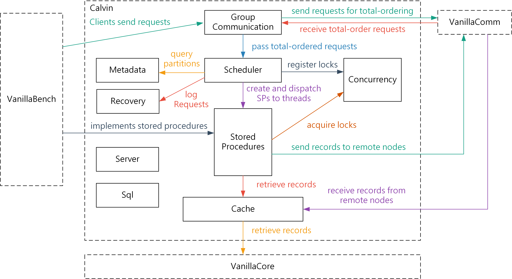

# Final Project

Let's implement a great distributed database architecture 'Calvin'.

(For now, it just can run microbenchmark with the properties in the repository.)

# Paper References:

Thomson, Alexander, and Daniel J. Abadi. "The case for determinism in database systems." Proceedings of the VLDB Endowment 3.1-2 (2010): 70-80.

Thomson, Alexander, et al. "Calvin: fast distributed transactions for partitioned database systems." Proceedings of the 2012 ACM SIGMOD International Conference on Management of Data. 2012.

## Architecture

The following figure demonstrates an example for the architecture of an implementation of Calvin. You may not need to follow this architecture.

Here is the workflow of executing a stored procedure:

1. The clinet (VanillaBench) sends a stored procedure request.
2. The group communication module receives the request and then passes the request to VanillaComm for total-ordering.
3. The group communication module receives total-ordered requests from VanillaComm, and then it passes these requests to the scheduler.
4. The scheduler analyzes each request, logs each request, generates an execution plan, registers locks for conservative locking, and then creates a stored procedure instance and dispatches the instance to a thread for execution.
    - During the analysis, it may have to query the metadata module for the partitions (the locations) of the requested records.
5. During the execution of a stored procedure, it retrieves records from the cache module, which further retrieves records from the storage engine of VanillaCore.
6. If a stored procedure needs to deliver a record to a remote node, it will send the record using P2p messaging API provided by VanillaComm. VanillaComm may also pass the received records to the cache module.
7. After the stored procedure finishes the execution, it commits the transaction and then sends the result back to the clinet (VanillaBench).

# Run Configurations (In Eclipse):

## Server Side:

Project:calvin
Main Class:org.vanilladb.calvin.server.CalvinServerStartUp

Program arguments

serverId(ex:0 , 1 , 2)
DBname(ex: 3partion-1, 3partition-2, 3 patition-3)

VM arguments

-Dorg.vanilladb.comm.config.file=target/classes/org/vanilladb/comm/vanillacomm.properties
-Dorg.vanilladb.bench.config.file=target/classes/org/vanilladb/bench/vanillabench.properties
-Dorg.vanilladb.core.config.file=target/classes/org/vanilladb/core/vanilladb.properties
-Djava.util.logging.config.file=target/classes/java/util/logging/logging.properties

## Client Side:

Project:bench

Main Class:org.vanilladb.bench.App

Program argument:

load or benchmark(1/2)
clientId(ex:0,1,2,.....)

VM argument:

-Dorg.vanilladb.comm.config.file=target/classes/org/vanilladb/comm/vanillacomm.properties
-Dorg.vanilladb.bench.config.file=target/classes/org/vanilladb/bench/vanillabench.properties
-Dorg.vanilladb.core.config.file=target/classes/org/vanilladb/core/vanilladb.properties
-Djava.util.logging.config.file=target/classes/java/util/logging/logging.properties

